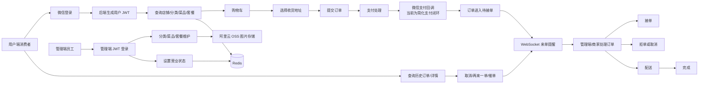

# 苍穹外卖产品总介绍

## 文档用途

本文用于简历项目介绍和模拟面试，帮助快速说明苍穹外卖的产品定位、角色边界、核心业务和第三方依赖。内容以当前后端源码为准；前端页面属于基于接口的业务推断，不代表仓库中存在对应前端源码。

## 参考源码

- 用户端 Controller：`sky-server/src/main/java/com/sky/controller/user/`
- 管理端 Controller：`sky-server/src/main/java/com/sky/controller/admin/`
- 支付回调：`sky-server/src/main/java/com/sky/controller/nofity/PayNotifyController.java`
- 订单业务：`sky-server/src/main/java/com/sky/service/impl/OrderServiceImpl.java`
- 用户登录业务：`sky-server/src/main/java/com/sky/service/impl/UserServiceImpl.java`
- 数据实体：`sky-pojo/src/main/java/com/sky/entity/`
- 数据库脚本：`sky-server/src/main/resources/sky.sql`

## 一、产品定位

苍穹外卖是一个面向单个餐饮商家的外卖订餐系统，后端采用 Spring Boot + MyBatis + MySQL 的单体多模块架构，并结合 Redis、JWT、WebSocket 和定时任务完成菜单展示、用户下单、支付推进和商家订单处理。

从产品角度看，它解决的是一条完整的餐饮履约链路：

1. 用户通过微信小程序登录。
2. 用户浏览分类、菜品和套餐。
3. 用户把菜品或套餐加入购物车，并维护收货地址。
4. 用户提交订单并进入支付流程。
5. 商家端收到来单提醒后接单、拒单、配送或完成订单。
6. 用户查看订单进度，必要时发起取消、再来一单或催单。

当前代码是课程版单体项目，重点覆盖基础业务闭环；库存、防超卖、优惠券、完整支付生产闭环等能力当前未实现或仅有简化代码，后续文档会单独标注。

## 二、目标用户和角色

### 1. 用户端消费者

主要诉求是方便选餐、下单和查看履约进度。

- 微信登录。
- 查看店铺营业状态。
- 按分类查看菜品和套餐。
- 查看套餐包含的菜品。
- 添加、减少、清空购物车商品。
- 新增、修改、删除和设置默认收货地址。
- 提交订单、发起支付、查询历史订单。
- 查看订单详情、取消订单、再来一单、催单。

### 2. 商家经营人员

当前代码没有单独的商家端 Controller 或商家角色模型。商家的经营动作由管理端接口承载，主要包括：

- 维护菜品分类。
- 维护菜品、菜品口味和上下架状态。
- 维护套餐及套餐包含的菜品。
- 设置店铺营业或打烊状态。
- 查看订单并执行接单、拒单、配送和完成。

因此在面试中可以表述为：`项目按用户端和管理端划分，管理端同时承载商家的日常经营和订单处理能力。`

### 3. 管理端员工

管理端员工通过账号密码登录，系统为其生成管理端 JWT。当前代码中的员工能力包括：

- 员工登录和退出接口。
- 员工分页查询。
- 新增、编辑员工。
- 启用或禁用员工账号。
- 查询员工详情。

## 三、核心功能清单

### 1. 用户端功能

| 功能域 | 当前能力 | 主要接口 |
|---|---|---|
| 登录 | 微信 `code` 换取 `openid`，新用户自动注册并生成 JWT | `POST /user/user/login` |
| 店铺 | 查询营业状态 | `GET /user/shop/status` |
| 分类 | 按类型查询启用分类 | `GET /user/category/list` |
| 菜品 | 按分类查询起售菜品和口味，使用 Redis 缓存 | `GET /user/dish/list` |
| 套餐 | 按分类查询起售套餐，使用 Spring Cache | `GET /user/setmeal/list` |
| 套餐详情 | 查询套餐包含的菜品 | `GET /user/setmeal/dish/{id}` |
| 购物车 | 添加、查看、减少、清空购物车 | `/user/shoppingCart/**` |
| 地址簿 | 地址增删改查、设置默认地址 | `/user/addressBook/**` |
| 下单 | 校验地址和购物车，写入订单及订单明细并清空购物车 | `POST /user/order/submit` |
| 支付入口 | 根据订单号进入支付处理 | `PUT /user/order/payment` |
| 订单 | 历史订单、订单详情、取消、再来一单、催单 | `/user/order/**` |

### 2. 商家经营功能

> 当前由管理端接口承载，以下是从订单和商品接口反推的商家业务。

| 功能域 | 当前能力 | 主要接口 |
|---|---|---|
| 店铺营业 | 设置和查询营业状态，状态写入 Redis | `PUT /admin/shop/{status}`、`GET /admin/shop/status` |
| 菜品分类 | 新增、分页查询、删除、修改、启停用、按类型查询 | `/admin/category/**` |
| 菜品 | 新增、分页查询、详情、修改、批量删除、起售停售、按分类查询 | `/admin/dish/**` |
| 菜品口味 | 随菜品新增和修改保存，详情中返回 | 由 `/admin/dish/**` 间接承载 |
| 套餐 | 新增、分页查询、详情、修改、批量删除、起售停售 | `/admin/setmeal/**` |
| 订单处理 | 查询、统计、详情、接单、拒单、取消、配送、完成 | `/admin/order/**` |
| 来单/催单提醒 | 服务端通过 WebSocket 广播提醒消息 | `WebSocketServer` |

### 3. 管理端功能

| 功能域 | 当前能力 | 主要接口 |
|---|---|---|
| 员工账号 | 登录、退出、增改查、启停用 | `/admin/employee/**` |
| 商品资料 | 分类、菜品、套餐维护 | `/admin/category/**`、`/admin/dish/**`、`/admin/setmeal/**` |
| 订单运营 | 订单处理和状态统计 | `/admin/order/**` |
| 店铺运营 | 营业状态管理 | `/admin/shop/**` |
| 文件资源 | 图片上传到阿里云 OSS | `POST /admin/common/upload` |

## 四、产品价值

### 对用户

- 把线下点餐流程转成线上浏览、购物车、下单和履约查询。
- 保存用户地址和历史订单，支持再来一单，减少重复操作。
- 通过催单能力让用户可以主动反馈订单等待情况。

### 对商家

- 集中维护菜品、套餐、分类和营业状态。
- 通过订单状态流转管理接单、配送和完成。
- 通过 WebSocket 接收来单和催单提醒，不必依赖人工刷新页面。
- 通过订单统计接口快速查看待接单、已接单和配送中订单数量。

### 对项目演进

- 先用单体架构快速实现业务闭环。
- 用 Redis 缓解高频菜单和店铺状态查询。
- 用 JWT 支持前后端分离鉴权。
- 用事务保证下单时订单、订单明细和购物车操作的一致性。
- 用定时任务补足超时订单自动取消和长时间配送订单处理。

## 五、第三方系统关系

### 1. 微信登录

用户端提交微信小程序登录 `code`，后端调用微信接口：

`https://api.weixin.qq.com/sns/jscode2session`

后端使用配置的 `appid`、`secret` 和 `js_code` 换取 `openid`。如果数据库中没有对应 `openid`，就创建用户记录；随后生成用户端 JWT 返回。

对应代码：

- `UserController.login`
- `UserServiceImpl.wxLogin`
- `UserServiceImpl.getOpenid`
- `WeChatProperties`

### 2. 微信支付

当前源码保留了微信支付工具和支付回调处理：

- `WeChatPayUtil` 提供支付和退款工具能力。
- `PayNotifyController` 提供 `POST/GET 兼容形式的 `/notify/paySuccess` 映射方法。
- 回调数据使用微信支付 API v3 密钥解密。
- 解密后取出商户订单号，调用 `OrderService.paySuccess` 更新订单状态。

但需要明确：

- **当前用户支付接口中的真实微信统一下单调用被注释。**
- 当前 `OrderServiceImpl.payment` 会查询订单，构造简化支付返回对象，并直接把订单推进到已支付和待接单状态，同时发送来单 WebSocket 消息。
- **当前回调方法会更新订单状态，但 `paySuccess` 方法本身没有发送 WebSocket 来单提醒。**
- **退款相关调用在管理端拒单/取消逻辑中有调用代码，但金额使用了示例金额，且退款状态闭环并不完整，不能按生产支付系统描述。**

详细支付分析见 `docs/支付链路说明.md`。

### 3. 阿里云 OSS

管理端上传图片时，后端生成 UUID 文件名，把文件上传到 OSS，并返回文件访问路径。菜品和套餐实体只保存图片 URL，不在 MySQL 中保存二进制文件。

对应代码：

- `CommonController.upload`
- `AliOssUtil`
- `AliOssProperties`
- `OssConfiguration`

## 六、整体业务流程图

## 七、当前未实现或仅简化的产品能力

- **库存与防超卖：当前未实现。** 现有数据库没有库存字段或库存表，下单流程也没有扣库存逻辑。
- **优惠券：当前未实现。** 当前实体、DTO、Mapper 和 SQL 中未发现优惠券相关模型。
- **完整退款闭环：当前未实现。** 虽有微信退款工具调用和部分业务代码，但没有完整的退款回调、幂等和退款状态管理闭环。
- **独立商家角色体系：当前未实现。** 当前使用管理端员工统一处理经营和订单操作。
- **支付主动查单：当前未实现。** 当前定时任务只处理订单超时和配送状态，没有调用微信支付查单接口。

## 面试关注点

- 不要说项目存在独立的“商家端服务”；准确说法是“管理端承载商家经营和订单处理”。
- 不要把当前支付接口描述成完整微信支付生产链路，应主动说明真实统一下单调用被注释，当前是简化实现。
- 产品价值不要只罗列页面，重点讲“用户下单到商家履约”的闭环。
- 可以把“当前基础闭环 + 后续并发演进”作为项目主线，但库存、优惠券和主动查单必须明确标记为规划中。
