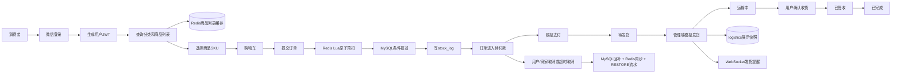

# 助农农产品电商平台产品总介绍

用途：用于简历和模拟面试，说明项目定位、用户角色、已实现能力、规划边界以及端到端业务流程。

## 参考源码

- 用户端 Controller：`sky-server/src/main/java/com/sky/controller/user/`
- 管理端 Controller：`sky-server/src/main/java/com/sky/controller/admin/`
- 支付回调：`sky-server/src/main/java/com/sky/controller/nofity/PayNotifyController.java`
- 商品业务：`sky-server/src/main/java/com/sky/service/impl/ProductServiceImpl.java`
- 订单业务：`sky-server/src/main/java/com/sky/service/impl/OrderServiceImpl.java`
- 库存业务：`sky-server/src/main/java/com/sky/service/impl/StockServiceImpl.java`
- 物流业务：`sky-server/src/main/java/com/sky/service/impl/LogisticsServiceImpl.java`
- 实体类：`sky-pojo/src/main/java/com/sky/entity/`
- 数据库脚本：`docs/sql/新增商品模型.sql`、`docs/sql/删除旧表.sql`

## 一、产品定位

本项目是一个从苍穹外卖改造而来的助农农产品电商平台，面向大众销售农产品，履约方式从即时配送调整为快递发货。当前重点不是接入真实快递或真实支付，而是先把商品、SKU、库存、订单和模拟物流的核心业务链路跑通。

与原外卖模型相比，当前改造的核心变化是：

- 商品从单一菜品/套餐调整为 `product` 商品主表和 `product_sku` 规格表。
- 价格和库存放在 SKU 上，不同规格可以有不同价格和库存。
- 下单时使用 Redis Lua 原子预扣，再使用 MySQL 条件更新兜底。
- 订单状态调整为电商履约流程，物流表只保存发货展示快照。

## 二、目标用户和角色

### 1. 普通消费者

消费者通过用户端完成：

- 微信登录并获取用户 JWT。
- 查看营业状态、分类、上架商品和 SKU。
- 选择具体 SKU 加入购物车。
- 维护收货地址。
- 提交订单、查看订单、取消订单和确认收货。
- 查看模拟物流信息、再来一单和催单。

### 2. 商家经营人员

当前没有独立的商家角色 Controller，商家经营动作由管理端员工账号承载：

- 商品和 SKU 维护。
- SKU 绝对库存设置。
- 订单查询、模拟发货、取消和完成。
- 店铺营业状态设置。
- 接收 WebSocket 来单和发货提醒。

### 3. 管理端员工

管理端员工使用账号密码登录，后端通过管理端 JWT 拦截器校验身份。当前可以进行员工管理、分类管理、商品管理、订单管理和文件上传。

## 三、核心功能清单

### 用户端

| 功能 | 当前状态 | 说明 |
|---|---|---|
| 微信登录 | 已实现 | `POST /user/user/login` 调用微信登录换取 openid，并生成用户 JWT |
| 分类查询 | 已实现 | `GET /user/category/list` |
| 商品列表 | 已实现 | `GET /user/product/list`，按分类查询，已接入 Redis 列表缓存 |
| SKU 查询 | 已实现 | `GET /user/product/sku/{productId}`，查询商品下的 SKU |
| 购物车 | 已实现 | 按 `productId + skuId` 加购；金额取 SKU 价格，图片取商品主图 |
| 地址簿 | 已实现 | 地址增删改查和默认地址 |
| 下单 | 已实现 | 创建订单、订单明细、清空购物车，并执行库存扣减 |
| 库存回补 | 已实现 | 用户取消或超时取消时回补库存 |
| 模拟物流查询 | 已实现 | `GET /user/logistics/{orderId}` |
| 确认收货 | 已实现 | `PUT /user/order/receive`，运输中进入已签收 |
| 催单/再来一单 | 已实现 | 通过订单接口和 WebSocket 完成提醒 |

### 管理端

| 功能 | 当前状态 | 说明 |
|---|---|---|
| 员工账号 | 已实现 | 登录、退出、分页、编辑、启停用 |
| 分类管理 | 已实现 | 分类新增、分页、修改、删除、启停用 |
| 商品管理 | 已实现 | 商品和 SKU 的新增、修改、详情、分页、上下架 |
| 库存设置 | 已实现 | `PUT /admin/product/sku/stock` 设置 SKU 绝对库存 |
| 订单处理 | 已实现 | 查询、取消、拒单、模拟发货、完成 |
| 模拟物流发货 | 已实现 | `POST /admin/logistics/ship` |
| 店铺状态 | 已实现 | 营业/打烊状态存入 Redis |
| 图片上传 | 已实现 | 图片上传到阿里云 OSS |

## 四、已实现技术能力

### 1. 商品和 SKU 模型

`product` 保存商品名称、分类、主图、描述和上下架状态；`product_sku` 保存 SKU 编码、规格信息、价格、库存、锁定库存和状态。拆分后，一个商品可以对应多个可销售规格。

### 2. 下单防超卖

下单时先通过 `stock:sku:{skuId}` 执行 Redis Lua 原子预扣，再执行 MySQL：

```sql
UPDATE product_sku
SET stock = stock - #{count}
WHERE id = #{skuId}
  AND stock >= #{count};
```

Redis 负责高并发下快速判断和扣减，MySQL 通过条件更新做最终校验。Redis 异常时当前实现允许降级为数据库扣减。

### 3. 库存回补和流水

用户取消、管理端拒单/取消、待付款订单超时取消时，系统根据订单明细回补 SKU 库存，并同步 Redis。`stock_log` 使用 `business_type` 记录：

- `1`：`INIT`，初始化或设置绝对库存
- `2`：`DEDUCT`，订单扣减
- `3`：`RESTORE`，订单取消、拒单或超时回补

### 4. 订单状态机

订单状态统一为：

`1 待付款 -> 2 待发货 -> 3 运输中 -> 4 已签收 -> 5 已完成`

取消分支为：

`1 待付款 -> 6 已取消`

`2 待发货 -> 6 已取消`

状态更新 SQL 带原状态条件，使用影响行数判断是否发生并发冲突或重复操作。

### 5. 模拟物流

管理端发货时固定使用“模拟快递”，生成 `MOCK-{订单号}` 单号，并把订单收货人、电话和地址保存到 `logistics`。物流表只存展示信息，订单 `status` 是唯一权威状态；用户确认收货只修改订单状态，不修改物流表。

### 6. 商品列表缓存

只有用户端商品列表接入缓存：

- Key：`cache:product:list:category:{categoryId}`，空分类使用 `all`
- Cache Aside：先查 Redis，未命中查 MySQL 后回填
- 空列表短 TTL，防止不存在分类反复打库
- `setIfAbsent` 互斥锁和 double check 防止热点 key 击穿
- TTL 加随机扰动，降低批量失效造成的雪崩
- 管理端商品新增、修改、上下架在事务提交后删除对应分类和 `all` 缓存

SKU 列表暂不缓存，因为当前 SKU 查询返回库存，库存变化频繁，缓存一致性成本更高。

### 7. 登录鉴权

用户端和管理端使用不同 JWT 配置和拦截器。拦截器解析 token 后把用户 id 或员工 id 放入 `BaseContext` 的 `ThreadLocal`，Service 可以直接获得当前登录身份。

## 五、第三方系统关系

### 微信登录

用户端登录业务会调用微信 `jscode2session` 接口，用小程序登录 code 换取 openid。没有真实小程序 code 时，无法完成真实微信登录。

### 阿里云 OSS

管理端上传图片时调用 OSS 工具，数据库只保存图片 URL，不保存图片二进制。

### 微信支付

**当前为模拟支付。** 用户调用支付接口后，代码按订单号查询订单，使用带原状态条件的更新将订单从待付款推进到待发货，并发送 WebSocket 来单提醒。真实统一下单调用目前被注释，不能描述为已实现真实收款。

支付回调接口和 API v3 解密代码仍保留，但真实支付回调验签、幂等和主动查单属于规划中。

## 六、整体业务流程图



## 七、明确的规划中功能

以下内容不能描述为当前已实现：

- 优惠券：表结构已经存在，但领取、锁定、使用和退回闭环未实现。
- 秒杀活动：当前有 Redis Lua 和库存扣减基础能力，但没有秒杀活动、限购和活动时间模型。
- 退款闭环：`refund_record` 表和部分工具调用痕迹存在，但退款申请、审核、真实退款回调和退款幂等未实现。
- 消息队列异步化：尚未引入 RocketMQ，当前使用同步事务和 `OrderTask` 定时扫表。
- 真实微信支付：当前是模拟支付，未接入真实收款 API。
- 接口限流、降级和熔断：未实现。
- 真实物流：不对接快递公司，只实现模拟发货和物流展示。
- 溯源、农户档案、SaaS 多租户、微信订阅消息和区块链存证：不在项目范围内。

## 面试关注点

- 先讲业务变化：从外卖商品改成有规格、有库存的农产品 SKU。
- 再讲核心技术：Redis Lua 预扣、MySQL 条件扣减、失败补偿和库存流水。
- 订单状态要使用本文统一定义，不要再说“待接单、派送中”。
- 物流表是展示快照，订单状态是唯一权威。
- 支付必须主动说明是模拟实现，不能包装成真实微信收款。
