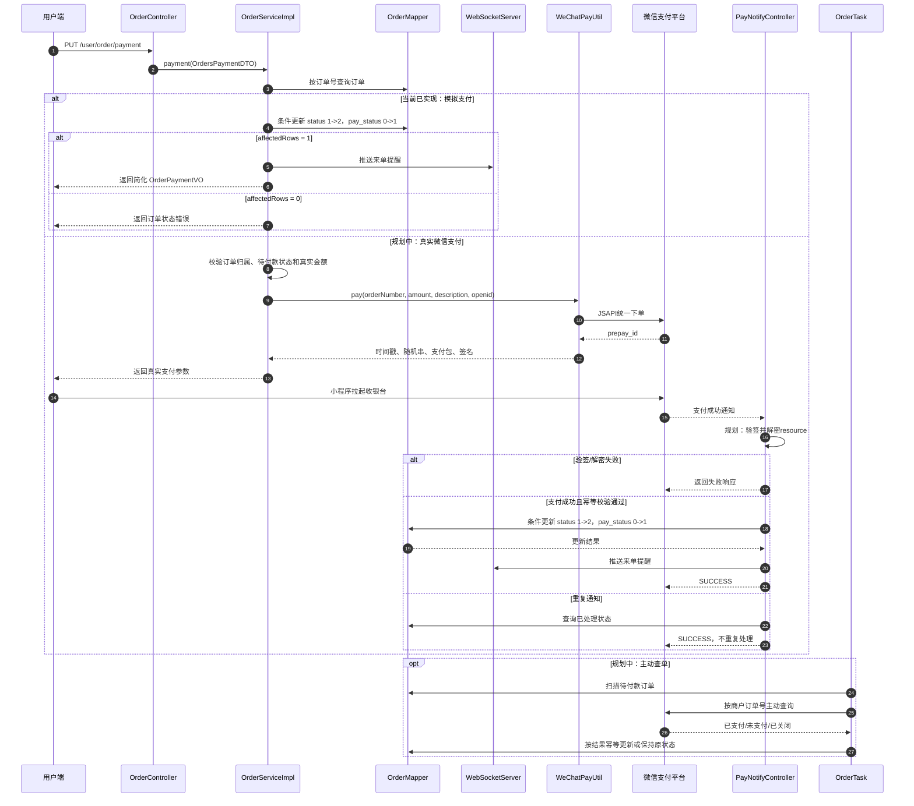

# 支付链路说明

用途：说明当前项目的模拟支付实现、订单状态推进方式，以及未来接入真实微信支付时需要补齐的链路。

## 参考源码

- 用户端支付入口：`sky-server/src/main/java/com/sky/controller/user/OrderController.java`
- 订单支付业务：`sky-server/src/main/java/com/sky/service/impl/OrderServiceImpl.java`
- 支付回调：`sky-server/src/main/java/com/sky/controller/nofity/PayNotifyController.java`
- 微信支付工具：`sky-common/src/main/java/com/sky/utils/WeChatPayUtil.java`
- 订单实体：`sky-pojo/src/main/java/com/sky/entity/Orders.java`
- 订单持久层：`sky-server/src/main/java/com/sky/mapper/OrderMapper.java`
- 订单状态定义：`sky-pojo/src/main/java/com/sky/enumeration/OrderStatus.java`
- 定时任务：`sky-server/src/main/java/com/sky/task/OrderTask.java`

## 一、当前结论

**当前项目是模拟支付，未接入真实微信支付收款 API。**

原因是项目没有营业执照和真实商户支付环境，因此当前不做真实收款。代码中保留了 `WeChatPayUtil` 和支付回调解密骨架，但不能把它们描述为已经完成真实支付闭环。

当前支付入口的实际行为是：

1. 用户调用 `PUT /user/order/payment`。
2. 后端按订单号查询订单。
3. 使用带原状态条件的更新，将订单从 `1 待付款` 更新为 `2 待发货`。
4. 同时把 `pay_status` 从 `0 未支付` 更新为 `1 已支付`。
5. 通过 WebSocket 向管理端推送来单提醒。
6. 返回一个简化的 `OrderPaymentVO`，不是微信小程序真实支付参数。

支付成功回调接口仍然存在，但真实微信平台不会在当前模拟环境中自动调用它。

## 二、当前模拟支付流程

### 1. 调用接口

```text
PUT /user/order/payment
```

请求体使用当前代码中的 `OrdersPaymentDTO`：

```json
{
  "orderNumber": "订单号",
  "payMethod": 1
}
```

`payMethod` 由当前代码沿用原项目约定，`1` 表示微信。

### 2. 当前代码如何推进状态

`OrderServiceImpl.payment` 调用 `OrderMapper.updateStatus`，实际语义是：

```sql
UPDATE orders
SET status = 2,
    pay_status = 1,
    checkout_time = CURRENT_TIME
WHERE id = ?
  AND status = 1;
```

如果影响行数为 `0`，说明订单不存在待付款状态，可能已经支付、取消或被其他请求处理，接口会拒绝本次操作。这样可以防止重复支付重复推进订单状态。

当前支付成功状态为：

```text
1 待付款 -> 2 待发货
```

这里的支付状态更新使用了条件更新，但当前支付方法还没有显式校验订单是否属于当前登录用户，这属于后续安全完善项。

### 3. 当前返回值

当前代码构造并返回 `OrderPaymentVO`，但没有真实调用 `WeChatPayUtil.pay` 获取 `prepay_id`。因此前端不能依据当前返回值真正拉起微信收银台，只能把它当成模拟支付成功结果处理。

## 三、当前支付回调代码

### 1. 回调路径

```text
/notify/paySuccess
```

当前 Controller 使用 `@RequestMapping`，没有在注解上限制 HTTP 方法。

### 2. 当前已存在的处理步骤

`PayNotifyController.paySuccessNotify` 当前会：

1. 从 HTTP 请求读取通知 body。
2. 读取通知中的 `resource`。
3. 使用配置的 API v3 Key 解密 `ciphertext`。
4. 解析 `out_trade_no` 和 `transaction_id`。
5. 调用 `OrderService.paySuccess(outTradeNo)`。
6. 返回 `{"code":"SUCCESS","message":"SUCCESS"}`。

`OrderServiceImpl.paySuccess` 使用订单号查询订单，再通过带 `status = 1` 原状态条件的更新把订单推进到 `2 待发货`，并设置 `pay_status = 1`。

### 3. 当前没有实现的回调能力

- 当前没有真实微信统一下单，所以没有真实支付通知来源。
- `PayNotifyController` 当前代码中未看到显式微信回调签名验签。
- 当前没有专用支付回调记录表或通知去重表。
- 当前没有保存并校验 `transaction_id` 的幂等记录。
- 当前回调成功后没有在回调方法中发送 WebSocket 来单提醒，来单提醒主要位于模拟支付入口。

这些内容属于真实支付接入时的规划，不应说成已实现。

## 四、真实微信支付规划

### 1. 统一下单

真实接入时，后端需要：

1. 校验当前用户、订单归属、订单状态为 `1 待付款`、支付状态为 `0 未支付`。
2. 使用订单真实金额和订单号调用微信 JSAPI 统一下单。
3. 传入商户订单号、金额、商品描述和用户 openid。
4. 获取 `prepay_id`。
5. 生成时间戳、随机串、签名类型、支付包和签名。
6. 返回给小程序前端。

当前 `WeChatPayUtil.pay` 已预留的业务参数是：

- 商户订单号
- 金额
- 商品描述
- 用户 openid

但当前 `OrderServiceImpl.payment` 中这段真实调用被注释，属于规划中的接入代码。

### 2. 前端拉起收银台

【前端推断，无前端源码佐证】小程序拿到后端返回的微信支付参数后，调用微信支付能力完成支付。支付成功后，微信平台异步通知后端回调地址。

当前项目没有前端源码，也没有真实微信支付参数，所以这里只能描述规划流程。

### 3. 回调验签和解密

规划中的回调处理顺序：

1. 校验请求来源和微信回调签名。
2. 验签通过后解密 API v3 回调资源。
3. 读取商户订单号、微信交易号、支付金额和交易状态。
4. 校验支付金额与订单金额一致。
5. 根据商户订单号查订单。
6. 使用订单状态和支付状态做幂等判断。
7. 只有从 `待付款 + 未支付` 成功更新到 `待发货 + 已支付` 时，才执行一次后续通知。
8. 返回微信要求的成功响应。

为什么要幂等：微信可能重复通知，网络重试也可能让同一通知到达多次。状态条件更新和回调记录可以保证重复通知不会重复推进订单。

### 4. 主动查单

当前没有定时主动查单逻辑。`OrderTask` 目前只扫描超时未支付订单并执行取消回补，不调用微信查单接口。

规划中的主动查单流程：

1. 定时扫描 `status = 1` 且超过一定时间仍未结束的订单。
2. 根据商户订单号调用微信订单查询接口。
3. 如果微信返回已支付，按幂等规则更新订单为 `2 待发货`、`pay_status = 1`。
4. 如果微信返回未支付，继续等待或交给超时取消任务。
5. 如果微信返回关闭，保持订单取消结果。

当前不实现该功能，因为项目暂不接入真实微信支付。

## 五、支付时序图



## 六、面试表达建议

### 当前已实现

- 有支付入口接口。
- 模拟支付可以把订单从 `1 待付款` 推进到 `2 待发货`。
- 支付状态从 `0 未支付` 更新为 `1 已支付`。
- 使用原状态条件更新，重复支付会被拒绝。
- 模拟支付入口会通过 WebSocket 推送来单提醒。
- 有回调读取和 API v3 解密代码骨架。

### 当前未实现，规划如下

- 真实微信统一下单。
- 小程序真实收银台拉起。
- 显式回调验签。
- 支付金额校验。
- 回调记录和幂等表。
- 主动查单。
- 真实支付失败、关闭和超时处理。

面试时最稳妥的说法是：`当前没有营业执照和商户号，所以支付采用模拟实现；我保留了真实微信支付工具和回调解密骨架，真实接入时会补统一下单、验签、幂等和主动查单。`
