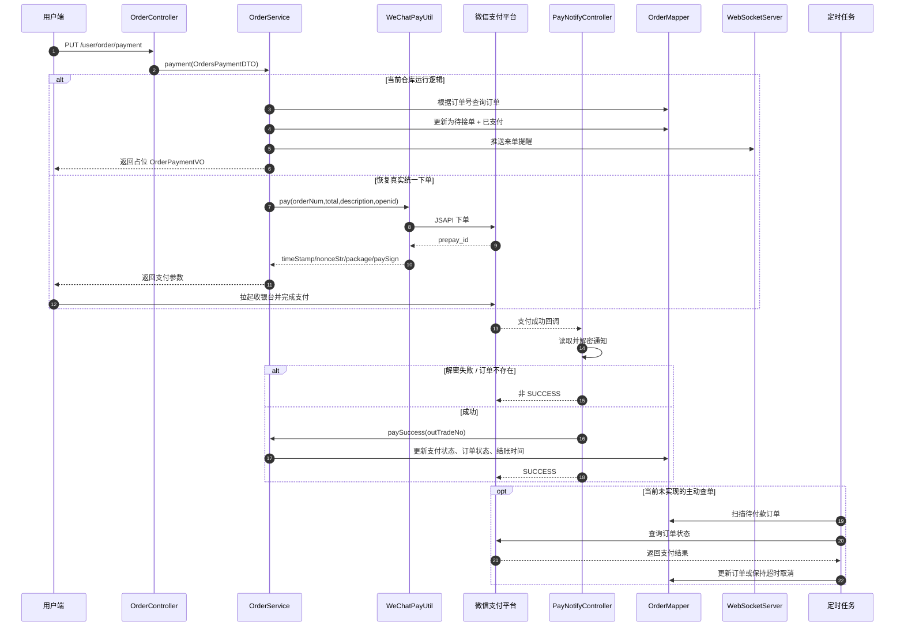

# 支付链路说明

## 文档用途

本文专门解释苍穹外卖的支付链路，重点说明“拉起收银台、微信回调、主动查询”三件事。内容严格按当前源码整理；如果某一步当前未实现，会直接标注“当前未实现，规划如下”。

## 参考源码

- 支付入口：`sky-server/src/main/java/com/sky/controller/user/OrderController.java`
- 订单支付：`sky-server/src/main/java/com/sky/service/impl/OrderServiceImpl.java`
- 微信支付工具：`sky-common/src/main/java/com/sky/utils/WeChatPayUtil.java`
- 支付回调：`sky-server/src/main/java/com/sky/controller/nofity/PayNotifyController.java`
- 订单实体：`sky-pojo/src/main/java/com/sky/entity/Orders.java`
- 支付 VO：`sky-pojo/src/main/java/com/sky/vo/OrderPaymentVO.java`
- 定时任务：`sky-server/src/main/java/com/sky/task/OrderTask.java`

## 一、拉起收银台

### 1. 当前源码里的实际情况

用户端调用：

- `PUT /user/order/payment`

对应到：

- `OrderController.payment()`
- `OrderServiceImpl.payment()`

当前代码中，`OrderServiceImpl.payment()` 做了三件事：

1. 按订单号查询订单。
2. 把订单更新为“已支付 + 待接单”。
3. 通过 WebSocket 推送来单提醒给商家端。

但要注意：

- **真实微信统一下单调用 `weChatPayUtil.pay(...)` 在源码里被注释了。**
- 因此当前返回的 `OrderPaymentVO` 只是占位结果，不是完整的微信小程序拉起支付参数。
- 这意味着当前版本更像“支付流程演示”，不是完整生产闭环。

### 2. 预留的真实链路

`WeChatPayUtil.pay()` 已经把真实链路写出来了，参数是：

- `orderNum`：商户订单号
- `total`：金额
- `description`：商品描述
- `openid`：微信用户 openid

它会向微信支付 JSAPI 下单接口发请求：

- `https://api.mch.weixin.qq.com/v3/pay/transactions/jsapi`

返回给前端的拉起参数包括：

- `timeStamp`
- `nonceStr`
- `package` / `packageStr`
- `signType`
- `paySign`

### 3. 前端拉起动作

【前端推断，无前端源码佐证】小程序拿到上述参数后，一般会调用微信支付能力拉起收银台，例如 `wx.requestPayment`。

### 4. 面试时怎么说

- 先说当前代码：支付接口已经打通了订单状态推进和商家提醒，但真实统一下单还在预留/注释状态。
- 再说预期方案：后续恢复 `WeChatPayUtil.pay()` 后，前端直接拿支付参数调起微信收银台。

## 二、微信回调

### 1. 回调路径

- `POST/REQUEST /notify/paySuccess`

对应到：

- `PayNotifyController.paySuccessNotify()`

### 2. 当前处理步骤

1. 读取微信通知 body。
2. 取出 `resource`。
3. 使用 `apiV3Key` 解密数据。
4. 解析出 `out_trade_no` 和 `transaction_id`。
5. 调用 `orderService.paySuccess(outTradeNo)` 更新订单状态。
6. 返回 `SUCCESS` 给微信。

### 3. 状态更新

`OrderServiceImpl.paySuccess()` 当前会把订单更新为：

- `status = 待接单`
- `payStatus = 已支付`
- `checkoutTime = 当前时间`

### 4. 幂等处理

当前源码里没有单独的回调记录表，也没有显式保存 `transaction_id` 做去重。

不过它是按订单号更新订单，重复回调不会创造新订单，属于“弱幂等”表现，但严格来说还不够完整。

### 5. WebSocket 推送说明

当前源码里，**来单提醒是在 `OrderServiceImpl.payment()` 里发送的**，不是在回调方法里发送的。

所以严格按源码说：

- 回调负责改订单状态。
- 来单提醒负责把消息推给商家端。
- 两者是分开的。

### 6. 当前缺口

- **当前未看到显式验签逻辑。**
- **当前未看到回调幂等记录表。**

## 三、主动查询

### 1. 当前是否有定时查单

**当前未实现。**

现有 `OrderTask` 只做两件事：

- 扫描超时未支付订单并自动取消。
- 扫描长时间处于派送中的订单并自动完结。

没有看到定时调用微信查单接口的逻辑。

### 2. 规划如下

如果要补主动查询，最简单的方式是：

1. 定时扫描 `待付款` 订单。
2. 调微信支付查单接口。
3. 如果微信已支付，则更新为已支付/待接单。
4. 如果长时间未支付，则保持超时取消逻辑。

这部分在面试里可以直接说成：`当前未实现，规划如下`，不用展开成完整设计。

## 四、支付时序图

## 面试关注点

- 一定要区分“订单状态”和“支付状态”。
- 当前项目的支付链路是“源码预留 + 简化实现”混合体，不要把它说成完整生产支付系统。
- 回调里目前能讲的重点是“读取 body、解密 resource、更新订单、返回 SUCCESS”。
- 主动查单当前未实现，直接说规划即可。
