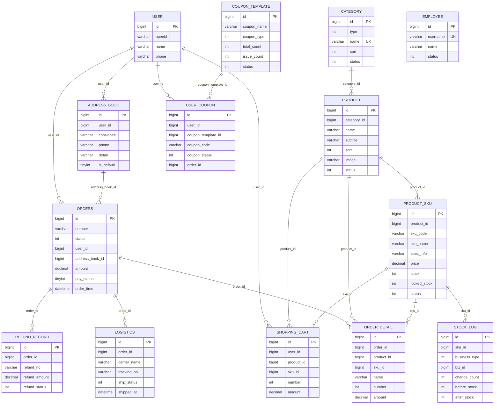

# 数据库设计

用途：说明当前助农农产品电商平台的核心表、字段、逻辑关系和索引设计，作为订单状态、支付状态和字段含义的统一事实来源。

## 参考源码

- 基础建表脚本：`sky-server/src/main/resources/sky.sql`
- 商品模型脚本：`docs/sql/新增商品模型.sql`
- 旧表清理脚本：`docs/sql/删除旧表.sql`
- 实体类：`sky-pojo/src/main/java/com/sky/entity/`
- Mapper 接口：`sky-server/src/main/java/com/sky/mapper/`
- Mapper XML：`sky-server/src/main/resources/mapper/`

## 一、当前数据库口径

当前应用代码使用的商品模型是：

`category -> product -> product_sku`

购物车和订单明细使用 `product_id + sku_id`。旧的 `dish`、`setmeal`、`setmeal_dish`、`dish_flavor` 已由清理脚本删除，当前代码不再引用。

需要注意：`sky.sql` 是课程项目的遗留基础脚本，其中仍然包含旧菜品/套餐建表语句；实际初始化改造后的数据库时，应在基础表基础上执行 `docs/sql/新增商品模型.sql`，验证新代码后再执行 `docs/sql/删除旧表.sql`。如果只执行 `sky.sql`，数据库结构会和当前 Java 代码不一致。

本项目使用逻辑外键，建表脚本没有声明物理 `FOREIGN KEY`。一致性主要依靠 Service 校验、事务和状态条件更新保证。

## 二、订单和支付状态

### 订单状态 `orders.status`

| 值 | 含义 | 主要触发 |
|---|---|---|
| `1` | 待付款 | 提交订单 |
| `2` | 待发货 | 模拟支付成功或支付回调成功 |
| `3` | 运输中 | 管理端模拟发货 |
| `4` | 已签收 | 用户确认收货 |
| `5` | 已完成 | 管理端完成订单 |
| `6` | 已取消 | 用户取消、商家取消/拒单或超时取消 |

允许的主要迁移为：

`1 -> 2`、`1 -> 6`、`2 -> 3`、`2 -> 6`、`3 -> 4`、`4 -> 5`

`5` 和 `6` 是终态。状态更新 SQL 带 `where id = ? and status = ?`，影响行数为 `0` 时拒绝本次迁移，防止并发重复操作。

### 支付状态 `orders.pay_status`

| 值 | 含义 |
|---|---|
| `0` | 未支付 |
| `1` | 已支付 |
| `2` | 退款 |

支付状态和订单状态是两个字段。当前支付是模拟支付，真实退款闭环未实现。

## 三、ER 图

ER 图只绘制当前数据库中的核心表，不绘制已清理的旧商品表，也不绘制不在项目范围内的 `product_batch`、`farmer` 和区块链存证表。

## 四、核心表结构

### 1. `employee`

| 字段 | 类型 | 含义 |
|---|---|---|
| `id` | bigint PK AI | 员工主键 |
| `name` | varchar(32) | 姓名 |
| `username` | varchar(32) | 登录用户名 |
| `password` | varchar(64) | 登录密码 |
| `phone` | varchar(11) | 手机号 |
| `sex` | varchar(2) | 性别 |
| `id_number` | varchar(18) | 身份证号 |
| `status` | int | `0` 禁用，`1` 启用 |
| `create_time`、`update_time` | datetime | 创建/更新时间 |
| `create_user`、`update_user` | bigint | 创建/修改人 |

### 2. `user`

| 字段 | 类型 | 含义 |
|---|---|---|
| `id` | bigint PK AI | 用户主键 |
| `openid` | varchar(45) | 微信用户 openid |
| `name` | varchar(32) | 用户姓名 |
| `phone` | varchar(11) | 手机号 |
| `sex` | varchar(2) | 性别 |
| `id_number` | varchar(18) | 身份证号 |
| `avatar` | varchar(500) | 头像地址 |
| `create_time` | datetime | 注册时间 |

### 3. `category`

| 字段 | 类型 | 含义 |
|---|---|---|
| `id` | bigint PK AI | 分类主键 |
| `type` | int | 分类类型，保留原项目的 `1/2` 取值 |
| `name` | varchar(32) | 分类名称 |
| `sort` | int | 排序值 |
| `status` | int | `0` 禁用，`1` 启用 |
| `create_time`、`update_time` | datetime | 创建/更新时间 |
| `create_user`、`update_user` | bigint | 创建/修改人 |

### 4. `product`

| 字段 | 类型 | 含义 |
|---|---|---|
| `id` | bigint PK AI | 商品主键 |
| `category_id` | bigint | 所属分类 |
| `name` | varchar(64) | 商品名称 |
| `subtitle` | varchar(128) | 商品副标题 |
| `sort` | int | 商品排序 |
| `image` | varchar(255) | 商品主图 URL |
| `description` | varchar(500) | 商品描述 |
| `status` | int | `0` 下架，`1` 上架 |
| `create_time`、`update_time` | datetime | 创建/更新时间 |
| `create_user`、`update_user` | bigint | 创建/修改人 |

### 5. `product_sku`

| 字段 | 类型 | 含义 |
|---|---|---|
| `id` | bigint PK AI | SKU 主键 |
| `product_id` | bigint | 所属商品 |
| `sku_code` | varchar(64) | SKU 编码 |
| `sku_name` | varchar(128) | SKU 展示名称 |
| `spec_info` | varchar(500) | 规格 JSON 字符串 |
| `price` | decimal(10,2) | SKU 售价 |
| `stock` | int | 可售库存 |
| `locked_stock` | int | 锁定库存字段，当前业务未使用 |
| `status` | int | `0` 下架，`1` 上架 |
| `sort` | int | SKU 排序 |
| `create_time`、`update_time` | datetime | 创建/更新时间 |
| `create_user`、`update_user` | bigint | 创建/修改人 |

### 6. `shopping_cart`

| 字段 | 类型 | 含义 |
|---|---|---|
| `id` | bigint PK AI | 购物车记录主键 |
| `name` | varchar(32) | 加购时保存的商品/SKU展示名称 |
| `user_id` | bigint | 用户 id |
| `product_id` | bigint | 商品 id |
| `sku_id` | bigint | SKU id |
| `number` | int | 数量 |
| `amount` | decimal(10,2) | 加购时保存的 SKU 单价 |
| `image` | varchar(255) | 商品主图 URL |
| `create_time` | datetime | 创建时间 |

改造脚本只新增 `product_id`、`sku_id`，原表中可能仍有 `dish_id`、`setmeal_id`、`dish_flavor` 兼容列；当前实体、Mapper 和业务代码不再使用这些旧列。

### 7. `address_book`

| 字段 | 类型 | 含义 |
|---|---|---|
| `id` | bigint PK AI | 地址主键 |
| `user_id` | bigint | 所属用户 |
| `consignee` | varchar(50) | 收货人 |
| `sex` | varchar(2) | 性别 |
| `phone` | varchar(11) | 收货电话 |
| `province_code`、`province_name` | varchar | 省级编码/名称 |
| `city_code`、`city_name` | varchar | 市级编码/名称 |
| `district_code`、`district_name` | varchar | 区级编码/名称 |
| `detail` | varchar(200) | 详细地址 |
| `label` | varchar(100) | 地址标签 |
| `is_default` | tinyint(1) | `0` 非默认，`1` 默认 |

### 8. `orders`

| 字段 | 类型 | 含义 |
|---|---|---|
| `id` | bigint PK AI | 订单主键 |
| `number` | varchar(50) | 订单号 |
| `status` | int | 订单状态，取值见本文第二节 |
| `user_id` | bigint | 下单用户 |
| `address_book_id` | bigint | 下单时使用的地址 id |
| `order_time` | datetime | 下单时间 |
| `checkout_time` | datetime | 支付/结账时间 |
| `pay_method` | int | 支付方式，原代码约定 `1` 微信、`2` 支付宝 |
| `pay_status` | tinyint | 支付状态，取值见本文第二节 |
| `amount` | decimal(10,2) | 订单金额 |
| `remark` | varchar(100) | 订单备注 |
| `phone` | varchar(11) | 下单时保存的电话快照 |
| `address` | varchar(255) | 地址快照 |
| `user_name` | varchar(32) | 用户名称 |
| `consignee` | varchar(32) | 收货人快照 |
| `cancel_reason` | varchar(255) | 取消原因 |
| `rejection_reason` | varchar(255) | 拒单原因 |
| `cancel_time` | datetime | 取消时间 |
| `estimated_delivery_time` | datetime | 原外卖字段，当前仍保留 |
| `delivery_status` | tinyint(1) | 原配送字段，当前仍保留 |
| `delivery_time` | datetime | 当前可作为送达/完成时间 |
| `pack_amount` | int | 原打包费字段，当前仍保留 |
| `tableware_number` | int | 原餐具数量字段，当前仍保留 |
| `tableware_status` | tinyint(1) | 原餐具状态字段，当前仍保留 |

订单保存地址和商品展示信息快照，是为了避免用户后续修改地址或商品名称后，历史订单展示发生变化。

### 9. `order_detail`

| 字段 | 类型 | 含义 |
|---|---|---|
| `id` | bigint PK AI | 明细主键 |
| `name` | varchar(32) | 下单时的商品 + SKU 名称快照 |
| `image` | varchar(255) | 下单时的商品主图快照 |
| `order_id` | bigint | 订单 id |
| `product_id` | bigint | 商品 id |
| `sku_id` | bigint | SKU id |
| `number` | int | 购买数量 |
| `amount` | decimal(10,2) | 明细金额，当前按 SKU 单价乘购买数量计算 |

原表中可能仍有 `dish_id`、`setmeal_id`、`dish_flavor` 兼容列，当前代码不使用。

### 10. `stock_log`

| 字段 | 类型 | 含义 |
|---|---|---|
| `id` | bigint PK AI | 流水主键 |
| `sku_id` | bigint | SKU id |
| `business_type` | int | `1 INIT`、`2 DEDUCT`、`3 RESTORE` |
| `biz_id` | bigint | 关联业务 id，扣减/回补时通常为订单 id |
| `change_count` | int | 变动数量 |
| `before_stock` | int | 变更前库存 |
| `after_stock` | int | 变更后库存 |
| `remark` | varchar(255) | 变动说明 |
| `create_time` | datetime | 创建时间 |

记录前后库存是为了支持库存对账和问题追查：可以判断本次变动是否符合 `before_stock +/- change_count = after_stock`，而不只是看到最终库存。

### 11. `logistics`

| 字段 | 类型 | 含义 |
|---|---|---|
| `id` | bigint PK AI | 物流记录主键 |
| `order_id` | bigint | 订单 id |
| `carrier_code` | varchar(32) | 当前固定为 `MOCK` |
| `carrier_name` | varchar(64) | 当前固定为“模拟快递” |
| `tracking_no` | varchar(64) | 当前格式为 `MOCK-{订单号}` |
| `ship_status` | int | 发货时写入展示值，当前不作为订单状态权威 |
| `shipped_at` | datetime | 模拟发货时间 |
| `delivered_at` | datetime | 物流表字段，当前确认收货不更新 |
| `receiver_name` | varchar(64) | 发货时收货人快照 |
| `receiver_phone` | varchar(32) | 发货时电话快照 |
| `receiver_address` | varchar(255) | 发货时地址快照 |
| `create_time`、`update_time` | datetime | 创建/更新时间 |

物流表只存展示信息，`orders.status` 是唯一权威状态。这样避免订单和物流各维护一套状态导致不一致。当前物理表没有 `order_id` 唯一索引，但业务上通过订单从待发货到运输中的条件更新保证只成功发货一次。

### 12. `coupon_template`（规划中）

表结构已经存在，但当前没有优惠券 Controller、Service 业务闭环。

| 字段 | 类型 | 含义 |
|---|---|---|
| `id` | bigint PK AI | 模板主键 |
| `coupon_name` | varchar(64) | 优惠券名称 |
| `coupon_type` | int | `1` 满减、`2` 折扣、`3` 无门槛 |
| `threshold_amount` | decimal(10,2) | 使用门槛 |
| `discount_amount` | decimal(10,2) | 减免金额 |
| `discount_rate` | decimal(5,2) | 折扣率 |
| `total_count`、`issue_count` | int | 总发行量/已发放量 |
| `receive_limit` | int | 每人限领数量 |
| `valid_days` | int | 领取后有效天数 |
| `start_time`、`end_time` | datetime | 有效时间 |
| `status` | int | `0` 停用，`1` 启用 |
| `create_time`、`update_time`、`create_user`、`update_user` | 见脚本 | 审计字段 |

### 13. `user_coupon`（规划中）

| 字段 | 类型 | 含义 |
|---|---|---|
| `id` | bigint PK AI | 用户券主键 |
| `user_id` | bigint | 用户 id |
| `coupon_template_id` | bigint | 优惠券模板 id |
| `coupon_code` | varchar(64) | 券码 |
| `coupon_status` | int | `0` 未用、`1` 已用、`2` 已过期、`3` 冻结 |
| `order_id` | bigint | 使用时关联订单 |
| `used_time`、`expire_time` | datetime | 使用/过期时间 |
| `create_time`、`update_time` | datetime | 创建/更新时间 |

### 14. `refund_record`（规划中）

| 字段 | 类型 | 含义 |
|---|---|---|
| `id` | bigint PK AI | 退款记录主键 |
| `order_id` | bigint | 订单 id |
| `refund_no` | varchar(64) | 退款单号 |
| `refund_amount` | decimal(10,2) | 退款金额 |
| `refund_status` | int | `0` 待处理、`1` 成功、`2` 失败 |
| `reason` | varchar(255) | 退款原因 |
| `channel` | varchar(32) | 退款渠道 |
| `transaction_id` | varchar(64) | 支付/退款流水号 |
| `applied_at`、`success_at` | datetime | 申请/成功时间 |
| `create_time`、`update_time` | datetime | 创建/更新时间 |

## 五、为什么这样设计

### 1. 为什么拆 `product` 和 `product_sku`

商品主表保存所有规格共享的信息，例如商品名称、主图和描述；SKU 表保存真正可销售单元的信息，例如规格、价格和库存。这样一个“洛川苹果”可以同时有 5 斤装、10 斤装，避免把相同商品信息重复存多份。

### 2. 为什么库存放在 `product_sku`

不同规格通常对应不同库存。5 斤装和 10 斤装不能共用一个库存数字，否则无法准确判断购买哪个规格会卖完。SKU 是下单和扣库存的最小业务单元，所以库存放在 SKU 上。

### 3. 为什么 `stock_log` 记录前后库存

只记录变动数量无法判断当时库存是否正确。记录 `before_stock` 和 `after_stock` 后，可以审计每次初始化、扣减和回补，也方便定位 Redis、MySQL 或重复回补造成的差异。

### 4. 为什么用条件更新而不是悲观锁

当前扣减使用 `stock >= count` 条件更新，数据库直接完成判断和扣减，锁持有时间短，不需要先查询再显式加行锁。它比悲观锁更轻量，适合当前单体项目；Redis Lua 已经在入口处做原子预扣，MySQL 条件更新作为最终兜底。

### 5. 为什么订单状态用 `WHERE status = 原状态`

状态迁移本身也是并发竞争。例如两个管理端同时发货，只有第一个请求能把 `2` 更新成 `3`，第二个请求因为原状态已经不是 `2`，影响行数为 `0`，自然失败。这能防止重复发货、重复取消、重复确认收货。

### 6. 为什么物流表不维护独立状态

订单状态已经表达待发货、运输中和已签收。如果物流表再维护一套状态，就需要处理两套状态同步。当前物流表只保存模拟快递、单号、发货时间和地址快照，订单表作为唯一权威，降低复杂度和不一致风险。

### 7. 为什么只缓存商品列表，不缓存 SKU 列表

商品列表是读多写少的数据，且只返回商品主表，缓存失效范围容易控制。当前 SKU 查询返回库存，而库存会在下单、取消、超时回补和管理端设置时频繁变化，第一版不缓存 SKU，可以避免实时库存展示和缓存一致性问题。

### 8. 为什么不用 Caffeine

当前项目只部署单体服务，Redis 已经提供共享缓存；使用 Caffeine 会再引入 JVM 本地副本，需要处理本地缓存与 Redis、MySQL 的多级一致性。为了控制复杂度，当前选择 Redis + MySQL，不引入 Caffeine。

### 9. 为什么当前不用消息队列

当前核心写操作需要同步完成订单、库存和库存流水，直接使用 Spring 事务更容易验证一致性。项目规模和并发目标暂时不足以抵消 RocketMQ 的部署、重试、幂等和消息补偿成本；超时订单当前用 `OrderTask` 定时扫表。后续需要更高吞吐时，再评估消息队列异步化。

## 六、现有索引

根据当前建表脚本和新增脚本，可以确认：

| 表 | 当前索引 |
|---|---|
| `employee` | `PRIMARY KEY(id)`、唯一索引 `idx_username(username)` |
| `user` | `PRIMARY KEY(id)` |
| `category` | `PRIMARY KEY(id)`、唯一索引 `idx_category_name(name)` |
| `product` | `PRIMARY KEY(id)`、`idx_product_category_status(category_id,status)` |
| `product_sku` | `PRIMARY KEY(id)`、`idx_product_sku_product(product_id)`、`idx_product_sku_status(status)` |
| `shopping_cart` | `PRIMARY KEY(id)`；新增脚本未补组合索引 |
| `address_book` | `PRIMARY KEY(id)` |
| `orders` | `PRIMARY KEY(id)` |
| `order_detail` | `PRIMARY KEY(id)`；新增脚本未补 `order_id` 索引 |
| `stock_log` | `PRIMARY KEY(id)`、`idx_stock_log_sku(sku_id)` |
| `logistics` | `PRIMARY KEY(id)`、`idx_logistics_order(order_id)` |
| `coupon_template` | `PRIMARY KEY(id)` |
| `user_coupon` | `PRIMARY KEY(id)`、`idx_user_coupon_user_status(user_id,coupon_status)` |
| `refund_record` | `PRIMARY KEY(id)`、`idx_refund_record_order(order_id)` |

## 七、推荐补充索引

以下是针对当前 Mapper 查询路径的建议，不代表已经执行：

| 表 | 推荐索引 | 解决的问题 |
|---|---|---|
| `user` | `UNIQUE(openid)` | `UserMapper.getByOpenid` 微信登录按 openid 精确查询 |
| `orders` | `UNIQUE(number)` | `getByNumber` 支付入口和回调按订单号查询 |
| `orders` | `(user_id,status,order_time)` | 用户历史订单按用户、状态和时间分页 |
| `orders` | `(status,order_time)` | `OrderTask` 扫描待付款超时订单 |
| `order_detail` | `(order_id)` | 订单详情、库存回补按订单查明细 |
| `shopping_cart` | `(user_id,product_id,sku_id)` | 加购和减少购物车按用户、商品、SKU 定位 |
| `address_book` | `(user_id,is_default)` | 查询用户默认地址和地址列表 |
| `product` | `(category_id,status,sort,create_time)` | 用户端分类商品列表过滤并按排序返回 |
| `product_sku` | `(product_id,sort,id)` | 查询商品 SKU 列表并按排序返回 |
| `stock_log` | `(sku_id,create_time)` | 按 SKU 按时间审计库存变动 |
| `logistics` | `UNIQUE(order_id)` | 业务上一个订单只允许一次模拟发货，数据库层再次兜底 |
| `user_coupon` | `(user_id,coupon_template_id,coupon_status)` | 后续判断用户领券次数和券状态 |
| `refund_record` | `(order_id,refund_status)` | 后续查询订单退款状态和处理记录 |

索引设计需要结合 `EXPLAIN` 验证。`LIKE '%关键词%'` 这类前后模糊查询通常不能充分利用普通 B-Tree 索引，不应仅因为字段常用就盲目加索引。

## 八、明确未纳入当前模型的内容

- `product_batch`、`farmer`：溯源和农户档案已明确移出项目范围。
- `dish`、`dish_flavor`、`setmeal`、`setmeal_dish`：旧商品表已由清理脚本删除，ER 图不绘制。
- 优惠券、退款、秒杀：部分表结构已经预留，但业务闭环未实现。
- 真实物流、SaaS 多租户、微信订阅消息、区块链存证：不在当前项目范围内。

## 面试关注点

- 先从 SKU 是最小销售单元讲清楚 `product/product_sku` 拆分。
- 再讲 Redis Lua 负责高并发预扣，MySQL 条件更新负责最终安全。
- `stock_log` 的前后库存字段对应审计和对账，不只是日志打印。
- 订单状态和支付状态分开；物流表是快照，订单状态是唯一权威。
