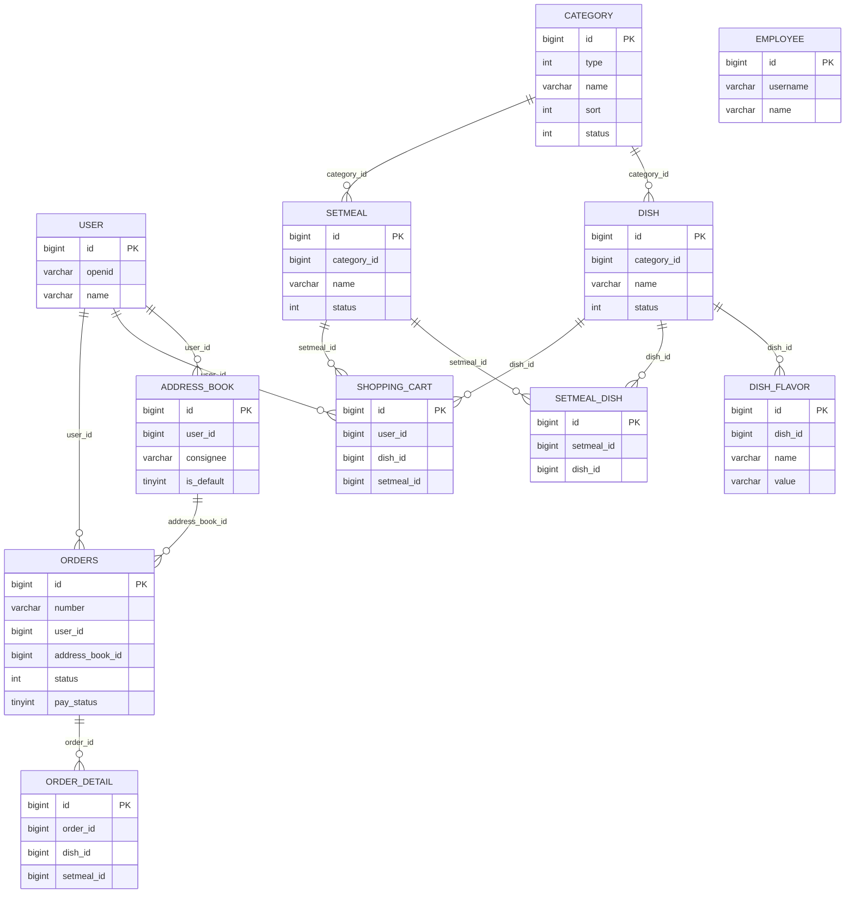

# 苍穹外卖数据库设计

## 文档用途

本文用于说明当前项目的数据库表结构、逻辑关系和索引设计建议，便于简历讲解和模拟面试。所有结论均基于 `sky.sql`、实体类和 Mapper XML 推导；当前未实现的扩展能力不会混入 ER 图。

## 参考源码

- 数据库脚本：`sky-server/src/main/resources/sky.sql`
- 实体类：`sky-pojo/src/main/java/com/sky/entity/`
- Mapper 接口：`sky-server/src/main/java/com/sky/mapper/`
- Mapper XML：`sky-server/src/main/resources/mapper/`

## 一、建模说明

- 本项目采用**逻辑外键**，SQL 中没有显式 `FOREIGN KEY` 约束。
- 主键统一使用 `bigint` 自增。
- 金额字段统一使用 `decimal(10,2)`。
- 时间字段统一使用 `datetime`。
- `orders.status` 的数据库注释保留了 `7退款` 语义，但当前代码主要使用 `1~6` 的订单流转，退款更多通过 `pay_status=2` 表达；面试时建议以本文件为准说明。

## 二、ER 图

## 三、表结构说明

### 1. `employee`

| 字段 | 类型 | 含义 |
|---|---|---|
| `id` | bigint PK AI | 主键 |
| `name` | varchar(32) | 姓名 |
| `username` | varchar(32) | 用户名 |
| `password` | varchar(64) | 密码 |
| `phone` | varchar(11) | 手机号 |
| `sex` | varchar(2) | 性别 |
| `id_number` | varchar(18) | 身份证号 |
| `status` | int | 状态，0 禁用，1 启用 |
| `create_time` | datetime | 创建时间 |
| `update_time` | datetime | 更新时间 |
| `create_user` | bigint | 创建人 |
| `update_user` | bigint | 修改人 |

### 2. `user`

| 字段 | 类型 | 含义 |
|---|---|---|
| `id` | bigint PK AI | 主键 |
| `openid` | varchar(45) | 微信用户唯一标识 |
| `name` | varchar(32) | 姓名 |
| `phone` | varchar(11) | 手机号 |
| `sex` | varchar(2) | 性别 |
| `id_number` | varchar(18) | 身份证号 |
| `avatar` | varchar(500) | 头像 |
| `create_time` | datetime | 注册时间 |

### 3. `category`

| 字段 | 类型 | 含义 |
|---|---|---|
| `id` | bigint PK AI | 主键 |
| `type` | int | 类型，1 菜品分类，2 套餐分类 |
| `name` | varchar(32) | 分类名称 |
| `sort` | int | 顺序 |
| `status` | int | 状态，0 禁用，1 启用 |
| `create_time` | datetime | 创建时间 |
| `update_time` | datetime | 更新时间 |
| `create_user` | bigint | 创建人 |
| `update_user` | bigint | 修改人 |

### 4. `dish`

| 字段 | 类型 | 含义 |
|---|---|---|
| `id` | bigint PK AI | 主键 |
| `name` | varchar(32) | 菜品名称 |
| `category_id` | bigint | 菜品分类 id |
| `price` | decimal(10,2) | 菜品价格 |
| `image` | varchar(255) | 图片 |
| `description` | varchar(255) | 描述信息 |
| `status` | int | 状态，0 停售，1 起售 |
| `create_time` | datetime | 创建时间 |
| `update_time` | datetime | 更新时间 |
| `create_user` | bigint | 创建人 |
| `update_user` | bigint | 修改人 |

### 5. `dish_flavor`

| 字段 | 类型 | 含义 |
|---|---|---|
| `id` | bigint PK AI | 主键 |
| `dish_id` | bigint | 菜品 id |
| `name` | varchar(32) | 口味名称 |
| `value` | varchar(255) | 口味数据列表 |

### 6. `setmeal`

| 字段 | 类型 | 含义 |
|---|---|---|
| `id` | bigint PK AI | 主键 |
| `category_id` | bigint | 套餐分类 id |
| `name` | varchar(32) | 套餐名称 |
| `price` | decimal(10,2) | 套餐价格 |
| `status` | int | 状态，0 停售/停用，1 起售/启用 |
| `description` | varchar(255) | 描述信息 |
| `image` | varchar(255) | 图片 |
| `create_time` | datetime | 创建时间 |
| `update_time` | datetime | 更新时间 |
| `create_user` | bigint | 创建人 |
| `update_user` | bigint | 修改人 |

### 7. `setmeal_dish`

| 字段 | 类型 | 含义 |
|---|---|---|
| `id` | bigint PK AI | 主键 |
| `setmeal_id` | bigint | 套餐 id |
| `dish_id` | bigint | 菜品 id |
| `name` | varchar(32) | 菜品名称，冗余字段 |
| `price` | decimal(10,2) | 菜品单价，冗余字段 |
| `copies` | int | 菜品份数 |

### 8. `shopping_cart`

| 字段 | 类型 | 含义 |
|---|---|---|
| `id` | bigint PK AI | 主键 |
| `name` | varchar(32) | 商品名称 |
| `image` | varchar(255) | 图片 |
| `user_id` | bigint | 用户 id |
| `dish_id` | bigint | 菜品 id |
| `setmeal_id` | bigint | 套餐 id |
| `dish_flavor` | varchar(50) | 口味 |
| `number` | int | 数量 |
| `amount` | decimal(10,2) | 金额 |
| `create_time` | datetime | 创建时间 |

### 9. `address_book`

| 字段 | 类型 | 含义 |
|---|---|---|
| `id` | bigint PK AI | 主键 |
| `user_id` | bigint | 用户 id |
| `consignee` | varchar(50) | 收货人 |
| `sex` | varchar(2) | 性别 |
| `phone` | varchar(11) | 手机号 |
| `province_code` | varchar(12) | 省级区划编号 |
| `province_name` | varchar(32) | 省级名称 |
| `city_code` | varchar(12) | 市级区划编号 |
| `city_name` | varchar(32) | 市级名称 |
| `district_code` | varchar(12) | 区级区划编号 |
| `district_name` | varchar(32) | 区级名称 |
| `detail` | varchar(200) | 详细地址 |
| `label` | varchar(100) | 标签 |
| `is_default` | tinyint(1) | 是否默认，0 否 1 是 |

### 10. `orders`

| 字段 | 类型 | 含义 |
|---|---|---|
| `id` | bigint PK AI | 主键 |
| `number` | varchar(50) | 订单号 |
| `status` | int | 订单状态，1 待付款，2 待接单，3 已接单，4 派送中，5 已完成，6 已取消，7 退款（注释保留） |
| `user_id` | bigint | 下单用户 |
| `address_book_id` | bigint | 地址 id |
| `order_time` | datetime | 下单时间 |
| `checkout_time` | datetime | 结账时间 |
| `pay_method` | int | 支付方式，1 微信，2 支付宝 |
| `pay_status` | tinyint | 支付状态，0 未支付，1 已支付，2 退款 |
| `amount` | decimal(10,2) | 实收金额 |
| `remark` | varchar(100) | 备注 |
| `phone` | varchar(11) | 手机号 |
| `address` | varchar(255) | 地址 |
| `user_name` | varchar(32) | 用户名称 |
| `consignee` | varchar(32) | 收货人 |
| `cancel_reason` | varchar(255) | 取消原因 |
| `rejection_reason` | varchar(255) | 拒单原因 |
| `cancel_time` | datetime | 取消时间 |
| `estimated_delivery_time` | datetime | 预计送达时间 |
| `delivery_status` | tinyint(1) | 配送状态，1 立即送出，0 选择具体时间 |
| `delivery_time` | datetime | 送达时间 |
| `pack_amount` | int | 打包费 |
| `tableware_number` | int | 餐具数量 |
| `tableware_status` | tinyint(1) | 餐具数量状态，1 按餐量提供，0 选择具体数量 |

### 11. `order_detail`

| 字段 | 类型 | 含义 |
|---|---|---|
| `id` | bigint PK AI | 主键 |
| `name` | varchar(32) | 名字 |
| `image` | varchar(255) | 图片 |
| `order_id` | bigint | 订单 id |
| `dish_id` | bigint | 菜品 id |
| `setmeal_id` | bigint | 套餐 id |
| `dish_flavor` | varchar(50) | 口味 |
| `number` | int | 数量 |
| `amount` | decimal(10,2) | 金额 |

## 四、现有索引

| 表 | 现有索引 |
|---|---|
| `employee` | `PRIMARY KEY(id)`, `UNIQUE idx_username(username)` |
| `user` | `PRIMARY KEY(id)` |
| `category` | `PRIMARY KEY(id)`, `UNIQUE idx_category_name(name)` |
| `dish` | `PRIMARY KEY(id)`, `UNIQUE idx_dish_name(name)` |
| `dish_flavor` | `PRIMARY KEY(id)` |
| `setmeal` | `PRIMARY KEY(id)`, `UNIQUE idx_setmeal_name(name)` |
| `setmeal_dish` | `PRIMARY KEY(id)` |
| `shopping_cart` | `PRIMARY KEY(id)` |
| `address_book` | `PRIMARY KEY(id)` |
| `orders` | `PRIMARY KEY(id)` |
| `order_detail` | `PRIMARY KEY(id)` |

## 五、索引设计建议

> 说明：以下是基于当前代码查询路径的建议，不代表已落地。

| 表 | 建议索引 | 解决的问题 |
|---|---|---|
| `user` | `UNIQUE idx_user_openid(openid)` | 微信登录按 `openid` 精确查用户，避免全表扫描 |
| `orders` | `UNIQUE idx_orders_number(number)` | 支付、回调、查单都按订单号精确查 |
| `orders` | `idx_orders_user_status_time(user_id, status, order_time)` | 用户端历史订单分页，按用户 + 状态 + 时间排序 |
| `orders` | `idx_orders_status_time(status, order_time)` | 管理端待接单/超时扫描等按状态和时间查 |
| `order_detail` | `idx_order_detail_order_id(order_id)` | 按订单 id 查明细、拼订单菜品字符串 |
| `dish_flavor` | `idx_dish_flavor_dish_id(dish_id)` | 菜品详情查口味、按菜品删口味 |
| `setmeal_dish` | `idx_setmeal_dish_setmeal_id(setmeal_id)` | 套餐详情查菜品、按套餐删关联 |
| `setmeal_dish` | `idx_setmeal_dish_dish_id(dish_id)` | 通过菜品反查关联套餐，禁止下架/删除时校验 |
| `shopping_cart` | `idx_cart_user_dish(user_id, dish_id, dish_flavor)` | 用户加减菜品购物车，按用户 + 菜品 + 口味定位 |
| `shopping_cart` | `idx_cart_user_setmeal(user_id, setmeal_id, dish_flavor)` | 用户加减套餐购物车，按用户 + 套餐 + 口味定位 |
| `address_book` | `idx_address_user_default(user_id, is_default)` | 查询用户地址列表、默认地址 |
| `dish` | `idx_dish_category_status_time(category_id, status, create_time)` | 用户端按分类查起售菜品，管理端列表也能受益 |
| `setmeal` | `idx_setmeal_category_status_time(category_id, status, create_time)` | 用户端按分类查起售套餐，管理端列表也能受益 |
| `category` | `idx_category_type_status_sort(type, status, sort)` | 分类列表按类型、启用状态和排序查询 |

### 补充说明

- `dish.name`、`setmeal.name`、`category.name`、`employee.username` 已有唯一索引，适合精确查找和唯一性约束。
- `phone like '%xxx%'`、`name like '%xxx%'` 这类前置模糊查询通常**不适合普通 B-Tree 索引**，不要因为“能加索引”就盲目加。
- `orders.number` 当前没有索引，但在支付回调、主动查单、订单详情等场景价值很高，优先级高于 `phone` 模糊索引。

## 六、逻辑关系说明

- `user` 1 对多 `address_book`
- `user` 1 对多 `shopping_cart`
- `user` 1 对多 `orders`
- `address_book` 1 对多 `orders`
- `category` 1 对多 `dish`
- `category` 1 对多 `setmeal`
- `dish` 1 对多 `dish_flavor`
- `dish` 1 对多 `setmeal_dish`
- `setmeal` 1 对多 `setmeal_dish`
- `orders` 1 对多 `order_detail`

## 七、未实现扩展备注

- **库存表 / 库存字段：当前未实现。**
- **优惠券表：当前未实现。**
- **退款记录表：当前未单独建表，退款能力仅有简化代码。**

## 面试关注点

- 面试时可以强调：本项目是**业务表分层清晰、逻辑关系明确，但物理外键较少**，依赖业务层和事务保证一致性。
- 重点讲 `orders.number`、`orders(user_id,status,order_time)`、`order_detail(order_id)`、`user(openid)` 这几类高频查询索引。
- 不要把 `phone`、`name` 这类 `LIKE '%xxx%'` 查询说成“索引一定生效”，这类是常见追问点。
- `orders.status` 与 `pay_status` 的语义要分开讲，退款不要只看订单状态。
