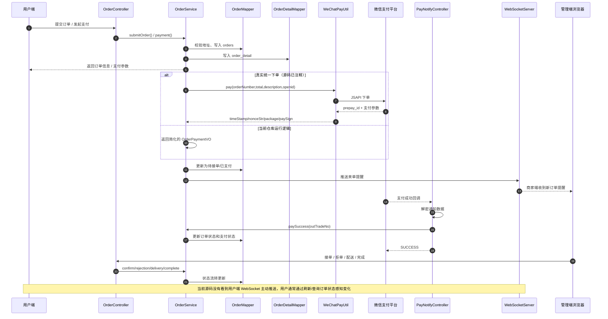
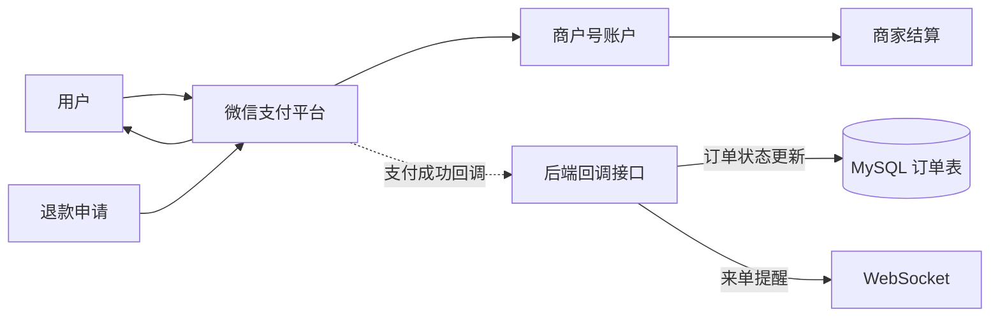
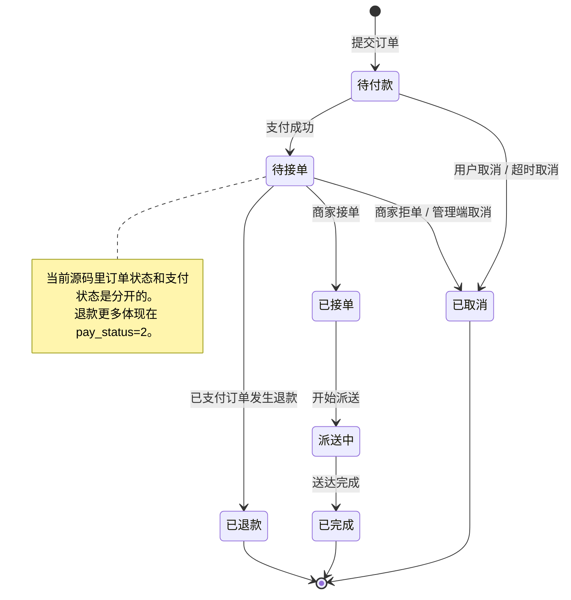

# 核心流程图

## 文档用途

本文把苍穹外卖里最重要的三条链路画成流程图，方便面试时讲清楚“下单、支付、通知、状态流转”这几个核心问题。内容基于当前源码；未实现的部分会在图中或图后注明。

## 参考源码

- 订单业务：`sky-server/src/main/java/com/sky/service/impl/OrderServiceImpl.java`
- 支付回调：`sky-server/src/main/java/com/sky/controller/nofity/PayNotifyController.java`
- 微信支付工具：`sky-common/src/main/java/com/sky/utils/WeChatPayUtil.java`
- WebSocket：`sky-server/src/main/java/com/sky/websocket/WebSocketServer.java`
- 定时任务：`sky-server/src/main/java/com/sky/task/OrderTask.java`
- 订单实体：`sky-pojo/src/main/java/com/sky/entity/Orders.java`

## 一、信息流图

## 二、资金流图

- 说明：当前代码里存在退款工具调用，但退款金额和退款闭环并不完整。
- 说明：真实统一下单调用在 `OrderServiceImpl.payment` 中被注释，当前更多是简化演示。

## 三、订单状态机图

## 四、面试关注点

- 信息流里最关键的是“订单写库、支付回调、状态推进、WebSocket 通知”四步。
- 资金流里要主动说明：当前仓库能看到退款调用，但没有完整退款闭环。
- 状态机里要分清 `status` 和 `pay_status`，不要把“已支付”和“已接单”混成一个状态。
- 当前用户端没有明确看到主动推送，别硬说“用户也收到了 WebSocket 通知”。
