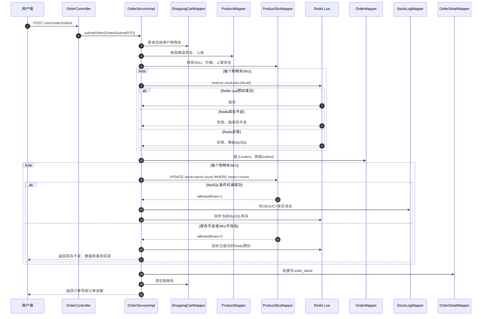
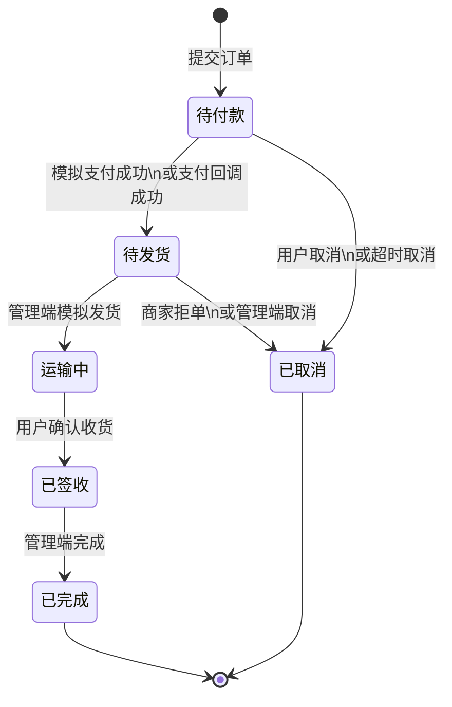
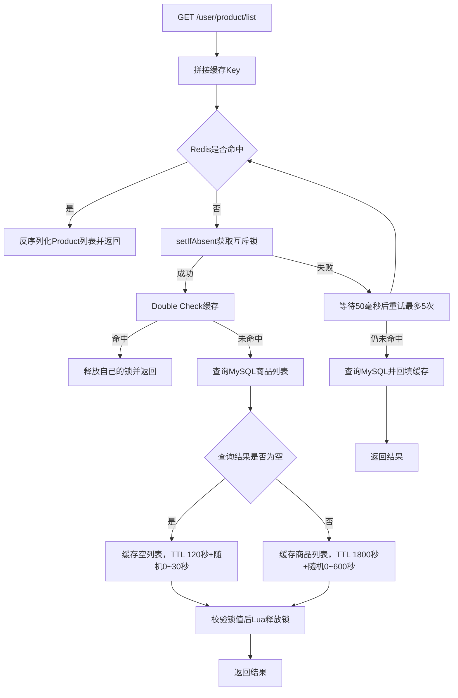

# 核心流程图

用途：用 Mermaid 图和简短说明展示当前系统的下单、订单状态、商品缓存、库存回补和模拟物流流程。

## 参考源码

- 用户端订单：`sky-server/src/main/java/com/sky/service/impl/OrderServiceImpl.java`
- 库存服务：`sky-server/src/main/java/com/sky/service/impl/StockServiceImpl.java`
- 库存脚本：`sky-server/src/main/resources/lua/deductStock.lua`
- 商品缓存：`sky-server/src/main/java/com/sky/service/impl/ProductServiceImpl.java`
- 订单状态机：`sky-server/src/main/java/com/sky/state/OrderStateMachine.java`
- 模拟物流：`sky-server/src/main/java/com/sky/service/impl/LogisticsServiceImpl.java`
- 订单持久层：`sky-server/src/main/java/com/sky/mapper/OrderMapper.java`、`sky-server/src/main/resources/mapper/OrderMapper.xml`
- 定时任务：`sky-server/src/main/java/com/sky/task/OrderTask.java`

## 一、下单流程



说明：

- Redis Lua 将读取、判断和扣减合并为一个原子操作，减少高并发下的竞争。
- MySQL 条件更新是最终落库校验，影响行数为 `0` 时认为扣减失败。
- 订单、订单明细、数据库库存扣减和库存流水处于 Spring 事务中。
- Redis 不是数据库事务资源，因此下单异常时额外执行 Redis 预扣补偿。
- 当前没有 RocketMQ，库存扣减是同步落库。

## 二、订单状态流转



状态定义来自 `OrderStatus`：

- `1`：待付款
- `2`：待发货
- `3`：运输中
- `4`：已签收
- `5`：已完成
- `6`：已取消

状态更新使用 `where id = ? and status = ?`。如果影响行数为 `0`，说明订单已经被其他请求改变状态，当前操作拒绝。退款不是当前订单状态机的一部分，支付状态仍单独使用 `pay_status` 字段表示。

## 三、商品列表缓存读流程



缓存约定：

- 分类列表 Key：`cache:product:list:category:{categoryId}`
- `categoryId` 为空时：`cache:product:list:category:all`
- 互斥锁 Key：`lock:product:list:category:{categoryId}`
- 锁 TTL：`10` 秒
- 锁值使用 UUID，释放锁时通过 Lua 比较锁值后再删除，避免误删其他线程的锁。

当前只缓存商品主表列表，不缓存 SKU 列表。原因是 SKU 查询结果包含库存，库存会在下单、取消、超时回补和管理端设置时变化，第一版缓存它会增加一致性复杂度。

写操作采用 Cache Aside：管理端商品新增、修改、上下架成功后，在事务提交之后删除对应分类缓存和 `all` 缓存。缓存只删除不直接更新，是因为重新组装完整列表容易遗漏条件和排序，删除后由下一次读请求回源重建更简单。

## 四、取消订单与库存回补

```mermaid
flowchart TD
    A[用户取消/商家取消/拒单/超时任务] --> B[查询订单]
    B --> C{状态机是否允许进入已取消}
    C -->|否| D[拒绝或直接跳过]
    C -->|是| E[UPDATE orders SET status=6 WHERE id=? AND status=?]
    E --> F{affectedRows是否为1}
    F -->|否| G[并发请求已处理，禁止重复回补]
    F -->|是| H[按订单明细查询SKU和数量]
    H --> I[MySQL stock = stock + count]
    I --> J[写RESTORE库存流水]
    J --> K[同步Redis stock:sku:{skuId}]
    K --> L[更新取消原因和取消时间]
    L --> M[事务提交]
```

说明：

- 只有状态条件更新成功的请求才会执行库存回补，这是防止重复回补的关键。
- `stock_log` 的 `business_type = 3` 表示 `RESTORE`。
- `OrderTask` 每分钟扫描超过 15 分钟仍为待付款的订单，调用超时取消方法。
- Redis 同步失败时当前实现记录日志，MySQL 仍作为库存依据。

## 五、模拟物流发货流程

```mermaid
flowchart TD
    A[管理端POST /admin/logistics/ship] --> B[查询订单]
    B --> C[状态机校验：待发货2 -> 运输中3]
    C -->|不允许| D[返回订单状态错误]
    C -->|允许| E[条件更新orders.status]
    E --> F{affectedRows是否为1}
    F -->|否| G[重复发货或并发冲突，拒绝]
    F -->|是| H[生成模拟快递展示信息]
    H --> I[carrier=模拟快递]
    I --> J[trackingNo=MOCK-订单号]
    J --> K[插入logistics发货快照]
    K --> L[WebSocket推送发货提醒]

    M[用户GET /user/logistics/{orderId}] --> N[校验订单归属]
    N --> O[查询logistics快照]
    O --> P[返回快递公司、单号、发货时间和收货信息]

    Q[用户PUT /user/order/receive] --> R[校验订单归属]
    R --> S[状态机校验：运输中3 -> 已签收4]
    S --> T[条件更新orders.status]
    T --> U[不更新logistics表]
```

物流表当前只保存发货时的展示信息，包括模拟快递、模拟单号、发货时间和收货人快照。订单 `status` 是唯一权威状态，物流表不单独推进运输或签收状态，因此不会出现两套状态不一致的问题。

## 面试关注点

- Redis Lua 解决的是高并发入口的原子预扣，MySQL 条件更新解决最终库存安全。
- 订单状态条件更新既能防重复发货，也能防重复取消和重复确认收货。
- 物流表是展示快照，不是第二套状态机。
- 当前系统没有 RocketMQ，超时取消依靠 `OrderTask` 定时扫表。
