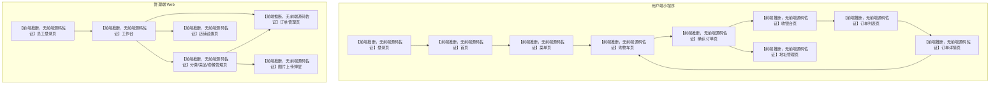

# 界面与接口映射

## 文档用途

本文根据后端 Controller 反推典型外卖前端页面，用于简历讲解和模拟面试。由于仓库未提供前端源码，所有页面内容均为业务推断，页面名和跳转关系都已标注为【前端推断，无前端源码佐证】。

## 参考源码

- 用户端接口：`sky-server/src/main/java/com/sky/controller/user/`
- 管理端接口：`sky-server/src/main/java/com/sky/controller/admin/`
- 支付回调：`sky-server/src/main/java/com/sky/controller/nofity/PayNotifyController.java`
- 订单支付：`sky-server/src/main/java/com/sky/service/impl/OrderServiceImpl.java`

## 一、用户端页面与接口映射

| 页面 | 主要接口 | 页面作用 | 备注 |
|---|---|---|---|
| 【前端推断，无前端源码佐证】登录页 | `POST /user/user/login` | 微信登录，获取用户 JWT | 当前代码以 `code` 换 `openid` |
| 【前端推断，无前端源码佐证】首页 | `GET /user/shop/status`、`GET /user/category/list` | 展示营业状态和分类入口 | 首页通常也是菜单入口 |
| 【前端推断，无前端源码佐证】菜单页 | `GET /user/dish/list`、`GET /user/setmeal/list` | 按分类展示菜品/套餐 | 菜品列表走 Redis，套餐列表走 Spring Cache |
| 【前端推断，无前端源码佐证】菜品详情弹层 | `GET /user/setmeal/dish/{id}`、`GET /user/dish/list` | 展示菜品口味、套餐包含菜品 | 当前只看到后端口味数据，没有独立详情页源码 |
| 【前端推断，无前端源码佐证】购物车页 | `POST /user/shoppingCart/add`、`GET /user/shoppingCart/list`、`POST /user/shoppingCart/sub`、`DELETE /user/shoppingCart/clean` | 增减商品、查看购物车、清空购物车 | 购物车以当前用户维度隔离 |
| 【前端推断，无前端源码佐证】地址管理页 | `GET /user/addressBook/list`、`POST /user/addressBook`、`GET /user/addressBook/{id}`、`PUT /user/addressBook`、`PUT /user/addressBook/default`、`DELETE /user/addressBook` | 地址增删改查、默认地址设置 | 下单页通常会复用默认地址 |
| 【前端推断，无前端源码佐证】确认订单页 | `POST /user/order/submit` | 核对地址、备注、餐具、预计送达时间并提交订单 | 当前下单会校验地址和购物车 |
| 【前端推断，无前端源码佐证】收银台页 | `PUT /user/order/payment` | 拉起支付、展示支付状态 | 当前真实微信统一下单调用被注释，前端只能按预期流程推断 |
| 【前端推断，无前端源码佐证】订单列表页 | `GET /user/order/historyOrders` | 查看历史订单 | 通常按状态筛选 |
| 【前端推断，无前端源码佐证】订单详情页 | `GET /user/order/orderDetail/{id}` | 查看订单明细 | 支持从历史订单跳转 |
| 【前端推断，无前端源码佐证】订单操作区 | `PUT /user/order/cancel/{id}`、`POST /user/order/repetition/{id}`、`GET /user/order/reminder/{id}` | 取消、再来一单、催单 | 催单会触发 WebSocket 通知 |

## 二、管理端页面与接口映射

| 页面 | 主要接口 | 页面作用 | 备注 |
|---|---|---|---|
| 【前端推断，无前端源码佐证】员工登录页 | `POST /admin/employee/login` | 管理端登录并获取 JWT | 退出接口存在但无复杂逻辑 |
| 【前端推断，无前端源码佐证】首页/工作台 | `GET /admin/order/statistics`、`GET /admin/shop/status` | 查看订单统计和营业状态 | 常见于管理后台首页 |
| 【前端推断，无前端源码佐证】员工管理页 | `GET /admin/employee/page`、`POST /admin/employee`、`GET /admin/employee/{id}`、`PUT /admin/employee`、`POST /admin/employee/status/{status}` | 员工列表、增删改查、启停用 | 主要服务于后台账号管理 |
| 【前端推断，无前端源码佐证】分类管理页 | `/admin/category/**` | 分类分页、增改删、启停用 | 菜品分类和套餐分类共用 |
| 【前端推断，无前端源码佐证】菜品管理页 | `/admin/dish/**` | 菜品分页、增改删、启停用、详情回显 | 菜品保存后会清理缓存 |
| 【前端推断，无前端源码佐证】套餐管理页 | `/admin/setmeal/**` | 套餐分页、增改删、启停用、详情回显 | 套餐缓存使用 `setmealCache` |
| 【前端推断，无前端源码佐证】订单管理页 | `/admin/order/conditionSearch`、`/admin/order/details/{id}`、`/admin/order/confirm`、`/admin/order/rejection`、`/admin/order/cancel`、`/admin/order/delivery/{id}`、`/admin/order/complete/{id}` | 搜索订单、查看详情、接单、拒单、取消、配送、完成 | 订单状态流转的核心页面 |
| 【前端推断，无前端源码佐证】店铺设置页 | `PUT /admin/shop/{status}`、`GET /admin/shop/status` | 营业/打烊切换 | 状态写入 Redis |
| 【前端推断，无前端源码佐证】图片上传页/弹层 | `POST /admin/common/upload` | 上传图片到 OSS | 常用于菜品和套餐编辑页 |

## 三、支付相关页面映射

| 页面 | 主要接口 | 页面逻辑 | 备注 |
|---|---|---|---|
| 【前端推断，无前端源码佐证】收银台页 | `PUT /user/order/payment` | 前端先拿到支付参数，再调用小程序支付能力 | 当前后端返回的是简化支付对象，不是完整生产闭环 |
| 【前端推断，无前端源码佐证】支付结果页 | `GET /user/order/orderDetail/{id}`、`GET /user/order/historyOrders` | 支付后回到订单详情/列表看状态 | 常见做法是轮询或重新拉详情 |
| 【前端推断，无前端源码佐证】商家提醒页 | WebSocket `/ws/{sid}` | 商家端收到来单/催单弹窗或提示音 | 当前由后端主动推送 |

## 四、页面跳转关系图

## 五、前端推断说明

- 仓库没有前端源码，所以页面名称、跳转顺序、按钮位置只能按后端接口和外卖业务习惯推断。
- 用户端页面重点围绕“登录 - 选餐 - 购物车 - 下单 - 支付 - 查单”。
- 管理端页面重点围绕“登录 - 经营维护 - 订单处理 - 营业设置”。
- 支付页面的真实调用链需要结合小程序代码验证，当前只能依据 `OrderPaymentVO` 和微信支付工具类推断。

## 面试关注点

- 面试时要主动说“前端页面是按接口反推”，不要说成自己见过前端源码。
- 用户端和管理端的职责边界要清晰，尤其是订单和店铺状态在管理端处理。
- 收银台页面是高频追问点，重点讲“后端返回支付参数，前端调起微信支付能力”。
