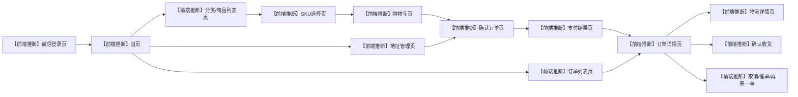
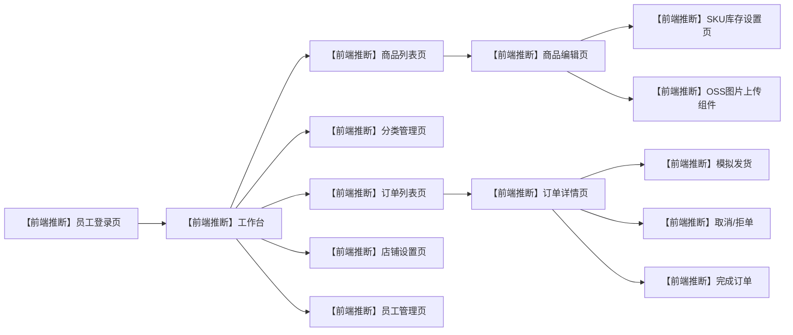

# 界面与接口映射

用途：根据当前后端 Controller 反推用户端小程序和管理端后台页面，帮助进行接口联调和面试讲解。仓库未包含前端源码，页面名称、跳转关系和页面交互均标注为【前端推断，无前端源码佐证】。

## 参考源码

- 用户端 Controller：`sky-server/src/main/java/com/sky/controller/user/`
- 管理端 Controller：`sky-server/src/main/java/com/sky/controller/admin/`
- 支付回调：`sky-server/src/main/java/com/sky/controller/nofity/PayNotifyController.java`
- 用户端业务：`sky-server/src/main/java/com/sky/service/impl/UserServiceImpl.java`、`ProductServiceImpl.java`、`OrderServiceImpl.java`
- 物流业务：`sky-server/src/main/java/com/sky/service/impl/LogisticsServiceImpl.java`
- WebSocket：`sky-server/src/main/java/com/sky/websocket/WebSocketServer.java`

## 一、用户端页面

| 页面 | 主要接口 | 页面作用 | 跳转关系 |
|---|---|---|---|
| 【前端推断，无前端源码佐证】微信登录页 | `POST /user/user/login` | 提交微信小程序登录 code，获取用户 JWT | 登录成功后进入首页 |
| 【前端推断，无前端源码佐证】首页 | `GET /user/shop/status`、`GET /user/category/list` | 展示营业状态和分类入口 | 点击分类进入商品列表 |
| 【前端推断，无前端源码佐证】商品列表页 | `GET /user/product/list?categoryId={id}` | 查询分类下的上架商品 | 点击商品进入 SKU/商品选择页 |
| 【前端推断，无前端源码佐证】商品规格选择页 | `GET /user/product/sku/{productId}` | 展示 SKU 名称、规格、价格和库存，选择具体 SKU | 选择 SKU 后加入购物车 |
| 【前端推断，无前端源码佐证】购物车页 | `POST /user/shoppingCart/add`、`GET /user/shoppingCart/list`、`POST /user/shoppingCart/sub`、`DELETE /user/shoppingCart/clean` | 增加、减少、查看和清空购物车 | 点击结算进入确认订单页 |
| 【前端推断，无前端源码佐证】地址管理页 | `/user/addressBook/list`、`POST /user/addressBook`、`GET /user/addressBook/{id}`、`PUT /user/addressBook`、`PUT /user/addressBook/default`、`DELETE /user/addressBook`、`GET /user/addressBook/default` | 维护收货地址和默认地址 | 从确认订单页进入或返回 |
| 【前端推断，无前端源码佐证】确认订单页 | `POST /user/order/submit` | 选择地址、填写备注并创建订单 | 提交成功后进入支付页或订单详情页 |
| 【前端推断，无前端源码佐证】支付结果页 | `PUT /user/order/payment`、`GET /user/order/orderDetail/{id}` | 当前用于模拟支付并查看订单状态 | 支付后进入订单详情/订单列表 |
| 【前端推断，无前端源码佐证】订单列表页 | `GET /user/order/historyOrders` | 分页查看历史订单，可按状态筛选 | 点击订单进入订单详情 |
| 【前端推断，无前端源码佐证】订单详情页 | `GET /user/order/orderDetail/{id}` | 查看订单主信息和 `product + SKU` 明细 | 可取消、确认收货、催单或查看物流 |
| 【前端推断，无前端源码佐证】物流详情页 | `GET /user/logistics/{orderId}` | 展示模拟快递、模拟单号、发货时间和收货地址 | 从运输中订单详情进入 |
| 【前端推断，无前端源码佐证】订单操作区 | `PUT /user/order/cancel/{id}`、`PUT /user/order/receive`、`POST /user/order/repetition/{id}`、`GET /user/order/reminder/{id}` | 取消、确认收货、再来一单和催单 | 操作成功后刷新订单详情 |

用户端订单状态以 `orders.status` 为准：

`1 待付款 -> 2 待发货 -> 3 运输中 -> 4 已签收 -> 5 已完成`

取消分支：

`1 待付款 -> 6 已取消`

`2 待发货 -> 6 已取消`

## 二、用户端页面流程图

## 三、管理端页面

当前没有独立的商家 Controller，商家经营和订单处理由管理端员工接口承载。

| 页面 | 主要接口 | 页面作用 | 跳转关系 |
|---|---|---|---|
| 【前端推断，无前端源码佐证】员工登录页 | `POST /admin/employee/login` | 登录并获取管理端 JWT | 登录成功后进入工作台 |
| 【前端推断，无前端源码佐证】工作台 | `GET /admin/order/statistics`、`GET /admin/shop/status` | 查看订单状态数量和营业状态 | 进入订单、商品或店铺设置 |
| 【前端推断，无前端源码佐证】员工管理页 | `GET /admin/employee/page`、`POST /admin/employee`、`GET /admin/employee/{id}`、`PUT /admin/employee`、`POST /admin/employee/status/{status}`、`POST /admin/employee/logout` | 员工账号增改查、启停用和退出 | 管理端内部页面 |
| 【前端推断，无前端源码佐证】分类管理页 | `POST /admin/category`、`GET /admin/category/page`、`DELETE /admin/category`、`PUT /admin/category`、`POST /admin/category/status/{status}`、`GET /admin/category/list` | 商品分类维护 | 商品编辑页选择分类 |
| 【前端推断，无前端源码佐证】商品列表页 | `GET /admin/product/page`、`GET /admin/product/list` | 商品搜索和分类查询 | 点击商品进入编辑/详情 |
| 【前端推断，无前端源码佐证】商品编辑页 | `POST /admin/product`、`GET /admin/product/{id}`、`PUT /admin/product`、`POST /admin/product/status/{status}` | 商品和 SKU 一起新增、修改、上下架 | 保存后返回商品列表 |
| 【前端推断，无前端源码佐证】SKU库存设置页 | `PUT /admin/product/sku/stock` | 设置 SKU 绝对库存 | 从商品详情或商品编辑页进入 |
| 【前端推断，无前端源码佐证】订单列表页 | `GET /admin/order/conditionSearch`、`GET /admin/order/statistics` | 按订单号、手机号、状态、时间筛选订单 | 点击订单进入详情 |
| 【前端推断，无前端源码佐证】订单详情页 | `GET /admin/order/details/{id}` | 查看订单和商品明细 | 可取消、拒单、发货或完成 |
| 【前端推断，无前端源码佐证】模拟发货操作 | `POST /admin/logistics/ship` | 将待发货订单推进为运输中并生成物流快照 | 发货成功后回到订单详情 |
| 【前端推断，无前端源码佐证】订单状态操作 | `PUT /admin/order/confirm`、`PUT /admin/order/rejection`、`PUT /admin/order/cancel`、`PUT /admin/order/delivery/{id}`、`PUT /admin/order/complete/{id}` | 兼容旧入口或执行取消、拒单、发货、完成 | 操作成功后刷新列表和详情 |
| 【前端推断，无前端源码佐证】店铺设置页 | `PUT /admin/shop/{status}`、`GET /admin/shop/status` | 营业/打烊切换 | 工作台也可展示 |
| 【前端推断，无前端源码佐证】图片上传组件 | `POST /admin/common/upload` | 上传商品主图到 OSS | 返回 URL 后写入商品表 |

## 四、管理端页面流程图

## 五、支付页面映射

| 页面 | 实际接口 | 当前行为 | 状态 |
|---|---|---|---|
| 【前端推断，无前端源码佐证】收银台页 | `PUT /user/order/payment` | 后端按订单号查询并把订单从待付款推进为待发货，返回简化 `OrderPaymentVO` | 已实现模拟支付 |
| 【前端推断，无前端源码佐证】支付结果页 | `GET /user/order/orderDetail/{id}`、`GET /user/order/historyOrders` | 刷新订单状态和支付状态 | 已实现查询 |
| 【前端推断，无前端源码佐证】微信回调入口 | `/notify/paySuccess` | 后端读取并解密回调数据，调用订单服务更新状态 | 保留回调代码，真实支付未接入 |

真实微信收银台需要小程序调用微信支付能力，但当前没有真实统一下单参数，因此不能按真实收款流程联调。

## 六、前端推断边界

- 仓库没有小程序或 Web 前端源码，页面名称、按钮和跳转关系都是【前端推断，无前端源码佐证】。
- 后端没有商品详情专用用户端接口，商品详情页需要先调用商品列表和 SKU 查询接口组合展示。
- 后端没有管理端物流查询接口，管理端可以通过订单详情查看订单数据，但用户端物流查询接口会校验订单归属。
- 当前没有优惠券、秒杀、退款申请、快递轨迹和真实微信支付页面对应的后端接口。

## 面试关注点

- 准确说法是“根据后端 Controller 反推页面”，不要声称掌握前端源码。
- 用户端核心页面链路是登录、商品列表、SKU 选择、购物车、确认订单、模拟支付、订单详情和物流查询。
- 管理端核心链路是登录、商品/SKU维护、订单查询、模拟发货和订单完成。
- 页面状态展示以 `orders.status` 为准，`logistics` 只提供模拟快递的展示字段。
